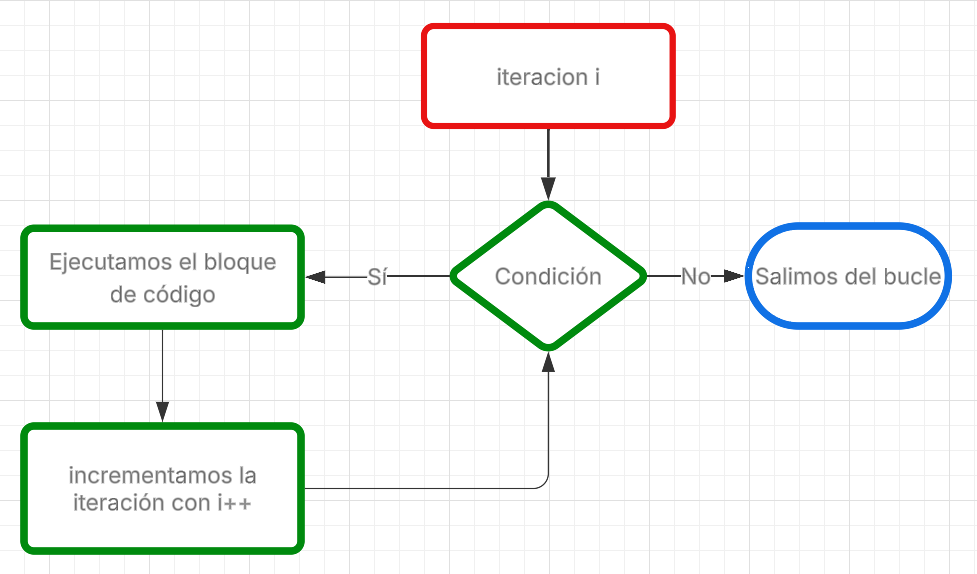

# Bucles ♾️
Un bucle o ciclo, es una sentencia de instrucciones que repite una y otra vez un bloque de código hasta cumplir una condición.
Hay diferentes tipos de bucles, estan los bucles `for`, `while` y `do while`.

<br>


> Estructura de un bucle

<br>

Se utilizan bucles para tareas en las que es necesario repetir la misma acción varias veces. Hay muchas tareas de este tipo en el desarrollo. Por ejemplo:
- Contar datos de un archivo línea por línea;
- Procesar cada elemento de una estructura de datos por turno;
- Modificar una serie de datos;
- Resolver un problema matemático;
- Actualizar la pantalla.

## Bucles For.
Este es un bucle que se ejecuta una cantidad determinada de veces. Donde tenemos una variable de iteracion `i` que debe cumplir una condicion, si la condición se cumple, 
entonces ejecutaremos el bloque de codigo dentro del for e incrementaremos 1 a la variable de iteración, en caso contrario de que la condicion no se cumpla saldremos del bucle.
> Un caso estándar: se establece un iterador igual a 0. La condición es que el iterador sea menor que un cierto N. La acción es agregarle una unidad al iterador.
> El bucle se ejecutará N+1 veces, porque el conteo comienza desde cero.


<br>

### Estructura de un bucle for.
`for (variable de iteracion; condicion; incremento) {código}` <br>
veamos un ejemplo en lenguaje java:
```java
for (int i = 0; i <= 10; i++) {
  // este es un contador del 0 al 10
  System.out.println(i);
  // imprimiremos el valor de i en cada iteracion
  // Seguiremos el bucle cuando i sea menor o igual a 10
}
// cuando i sea igual a 10, saldremos del bucle
```

## Bucle while
El bucle `while` es una sentencia de flujo de control que permite ejecutar código repetidamente en función de una condición. Es útil cuando no se conoce de antemano el número de iteraciones.
Mientras la condicion sea verdadera el codigo dentro del `while` se ejecutara una y otra vez, hasta que la condicion sea falsa.
**Ejemplo en pseudocodigo**
```bash
contador = 0
mientras (contador < 5) {
  // bloque de codigo
  imprimir("Hola número: " + contador)
  contador = contador + 1 // ¡Importante! Actualizar la variable para evitar un bucle infinito
}
```
Su uso mas común es con expresiones booleanas.
```java
boolean isTrue = false;

while (!isTrue) {
  int n = 0;
  if (n == 5) {
    isTrue = true;
  } else {
    n ++;
  }
}
```
